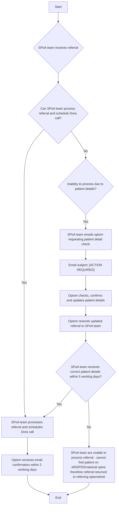

```mermaid
graph TD
    A[Start] --> B{SPoA team receives referral};

    B --> C{Can SPoA team process referral and schedule Dora call?};

    C -- Yes --> D[SPoA team processes referral and schedules Dora call];
    D --> E[Optom receives email confirmation within 2 working days];
    E --> F[End];

    C -- No --> G{Inability to process due to patient details?};

    G -- Yes --> H[SPoA team emails optom requesting patient detail check];
    H --> I[Email subject: #91;ACTION REQUIRED#93;];
    I --> J[Optom checks, confirms and updates patient details];
    J --> K[Optom resends updated referral to SPoA team];

    K --> L{SPoA team receives correct patient details within 5 working days?};

    L -- Yes --> D;
    L -- No --> M[SPoA team are unable to process referral - cannot find patient on eRS/PDS/national spine therefore referral returned to referring optometrist];
    M --> F;
```
