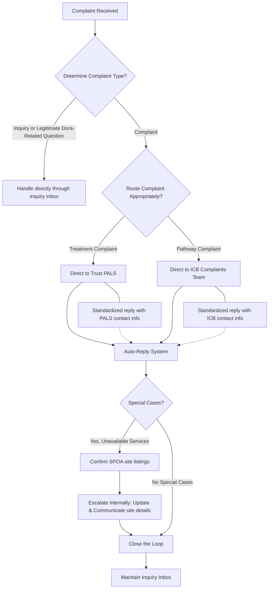

```mermaid
graph TD
    A[Complaint Received] --> B{Determine Complaint Type?};

    B -- Inquiry or Legitimate Dora-Related Question --> C[Handle directly through inquiry inbox];
    B -- Complaint --> D{Route Complaint Appropriately?};

    D -- Treatment Complaint --> E[Direct to Trust PALS];
    D -- Pathway Complaint --> F[Direct to ICB Complaints Team];

    E --> G[Auto-Reply System];
    F --> G;

    G --> H{Special Cases?};

    H -- Yes, Unavailable Services --> I[Confirm SPOA site listings];
    I --> J[Escalate internally: Update & Communicate site details];
    J --> K[Close the Loop];

    H -- No Special Cases --> K;

    K --> L[Maintain Inquiry Inbox];

    %% Sub-processes/Details (implied from text)
    E --- M[Standardized reply with PALS contact info];
    F --- N[Standardized reply with ICB contact info];

    %% Connecting sub-processes to main flow visually if desired, though often implied
    M -.-> G;
    N -.-> G;
```
