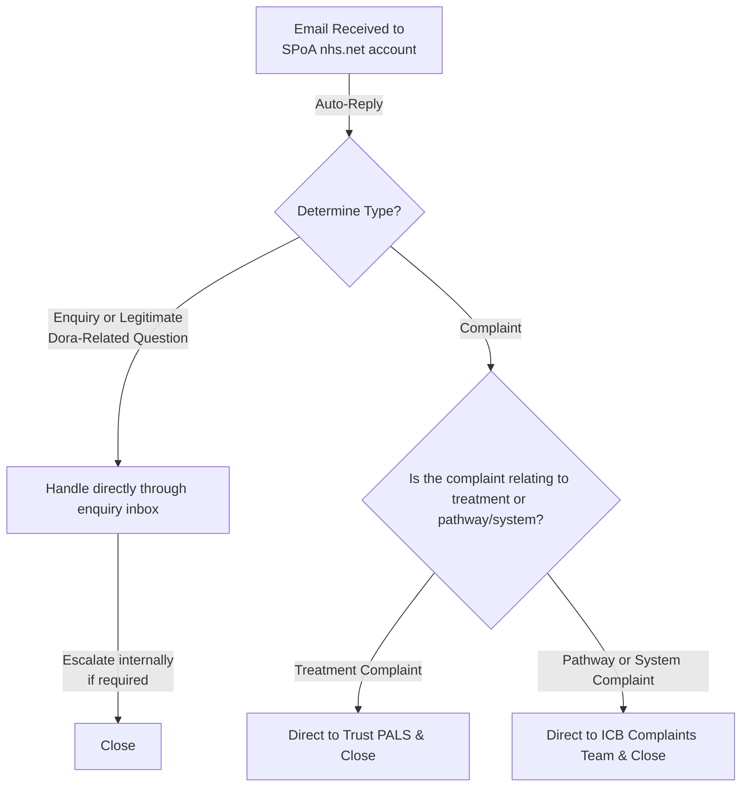

```mermaid
graph TD
    A[Email Received to 
    SPoA nhs.net account] -- Auto-Reply --> B{Determine Type?};
    
    B -- Enquiry or Legitimate 
    Dora-Related Question --> C[Handle directly through enquiry inbox];
    B -- Complaint --> D{Is the complaint relating to treatment or pathway/system?};
    C -- Escalate internally 
    if required --> K[Close];
    D -- Treatment Complaint --> E[Direct to Trust PALS & Close];
    D -- Pathway or System Complaint --> F[Direct to ICB Complaints Team & Close];
```
